### [Chat GPT Telegram Bot](https://t.me/ruschatsgpt_bot)

**Author:** @ArchieWh1te

**Language:** Python 3.10

**framework:** Aiogram 3.3.0

[](https://pypi.org/project/aiogram/3.3.0)
[](https://pypi.org/project/openai)
[](https://pypi.org/project/aiofiles)
[](https://pypi.org/project/SQLAlchemy)
[](https://pypi.org/project/asyncpg)
[](https://pypi.org/project/environs)
[](https://pypi.org/project/python-dotenv)
[](https://pypi.org/project/cachetools)
[](https://www.python.org/)


### ⚡️ ТЕСТ БОТА ➡️➡️➡️ [ТУТ](https://t.me/ruschatsgpt_bot)

### Чат-помощник на Aiogram и SQLAlchemy

**👮🏼‍♂️ Административная панель с системой управления:**

🤖 *Добавление моделей GPT*: Наша панель позволяет администраторам легко добавлять новые модели GPT, обеспечивая пользователям разнообразие и выбор.

👤 *Управление пользователями*: Мы ценим каждого пользователя. Администраторы могут управлять доступом, предоставлять привилегии и обеспечивать безопасность всех членов сообщества.

📋 *Система логирования*: Присутствует система ведения логирования чата и сервера.

**👥 Пользовательская часть:**

👤 *Личный профиль*: Каждый пользователь имеет возможность настроить свой личный профиль, включая выбор предпочтительных моделей GPT для более персонализированного опыта.

🤖 *Изменение моделей GPT*: Пользователи могут легко менять выбранные модели GPT, подстраивая их под свои потребности и предпочтения.

✉️ *Обращение в техническую поддержку*: Пользователи могут задавать свой вопрос администраторам.

#### ⭐️⭐️⭐️ P.S.: Бот будет постоянно обновляться, стремится к постоянному улучшению и развитию.


▶️ **Запуск бота**

Все зависимости хранятся в файле `requirements.txt`

Для запуска бота используйте файл ```app.py```

**💎 Для работы вам потребуется:**
1) Создать виртуальное окружение ```python -m venv venv```
2) Активировать в **Windows**: ```venv\Scripts\activate``` или в **Linux**: ```source venv/bin/activate``` 
3) Установить все зависимости ```pip install -r requirements.txt```.
4) Установить [PostgreSQL](https://www.postgresql.org/download/) и настроить его.
5) Отредактировать файл **.env** там указываете конфигурацию для подключения к **PostgreSQL**, токкен для бота, айди администраторов, айди разработчика, API ключ для OpenAI.
6) HOST к API указывается в таблице БД, либо через админ панель.

```
BOT_TOKEN=123456789:AABbCcDdEeFfGgHhJjKkOo

ADMINS=123456789

DEV_ID=123456789

DATABASE_HOST=localhost
DATABASE_USER=
DATABASE_PASSWORD=
DATABASE_NAME=
DATABASE_PORT=5432

OPENAI_API_KEY=sk-12345678910
```

💡 **Команды админа:**
```
/odminreg  - Добавить админа (Добавляет админа с правами, можно отключить команду в коде)

/panelodm  - Панель Администратора
```

💡 **Команды пользователя:**
```
/start - Панель управления

/profile  - Информация о профиле

/faq - FAQ

/help  - Помощь

/about - Обо мне
```

### 📷 Скриншоты

### Админская панель управления

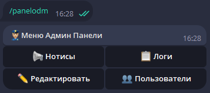

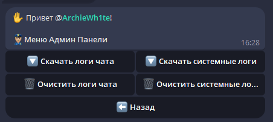

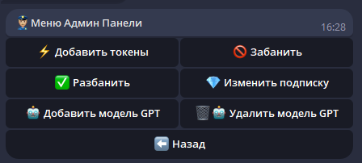

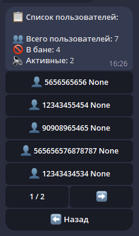


### Пользовательская панель управления

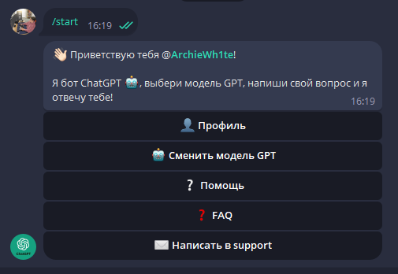

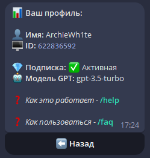

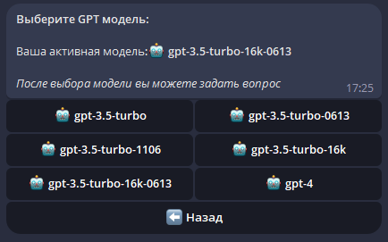

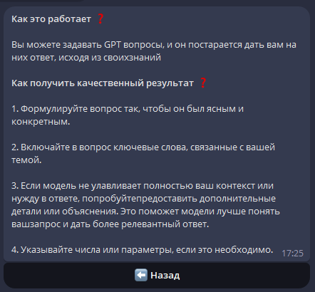

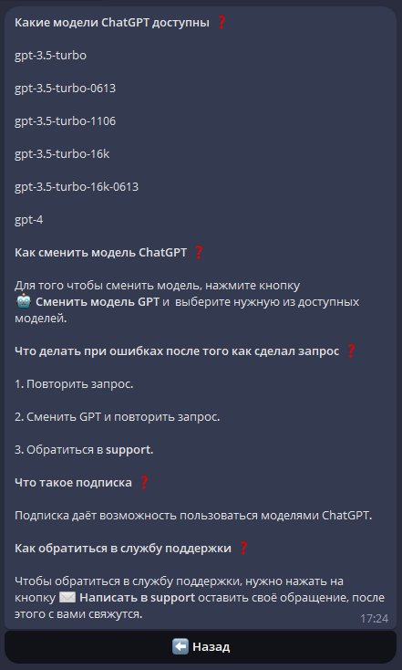


#### Команды
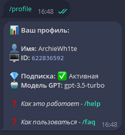

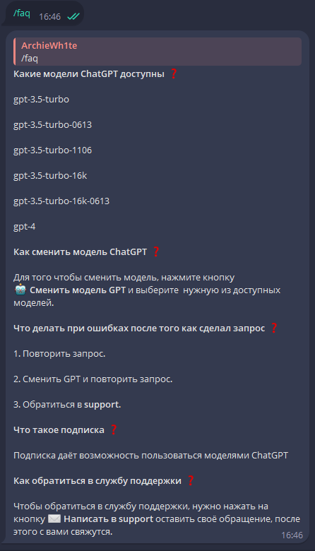

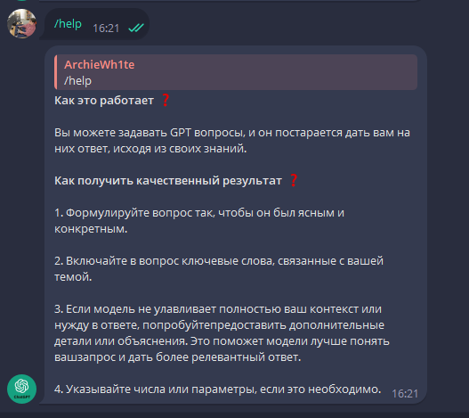

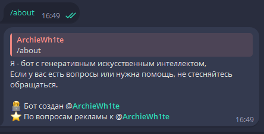